# ISAAC RAG

<p align="center">
  
</p>

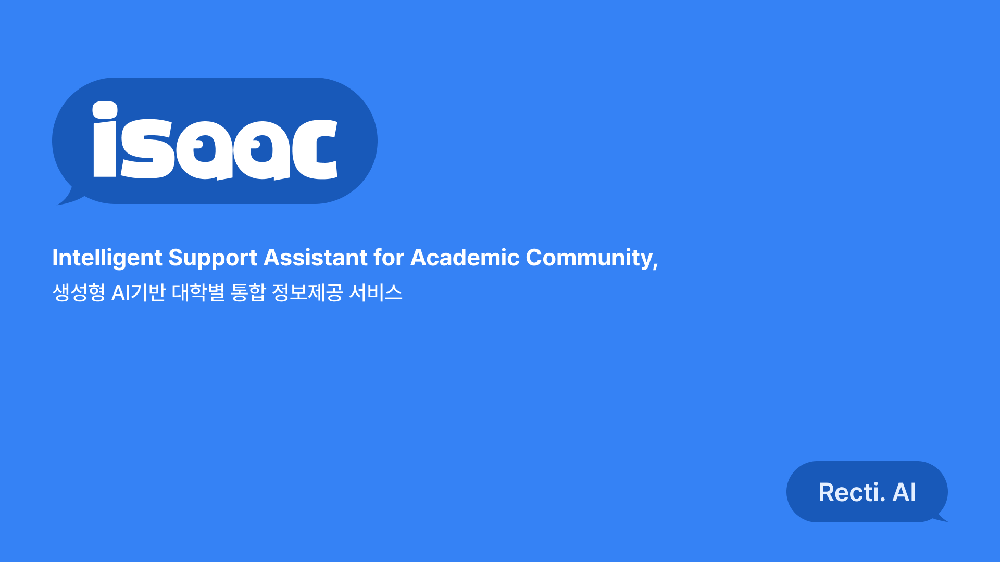

ISAAC은 연세대학교 구성원이 흩어진 학교 행정 정보를 빠르게 찾도록 돕는 AI 조교입니다.

이 저장소는 그중 **RAG 서버, Gradio 데모 화면, `/api/chat` 스트리밍 API**를 담고 있습니다.

## 문제

|  |  |
| --- | --- |
| 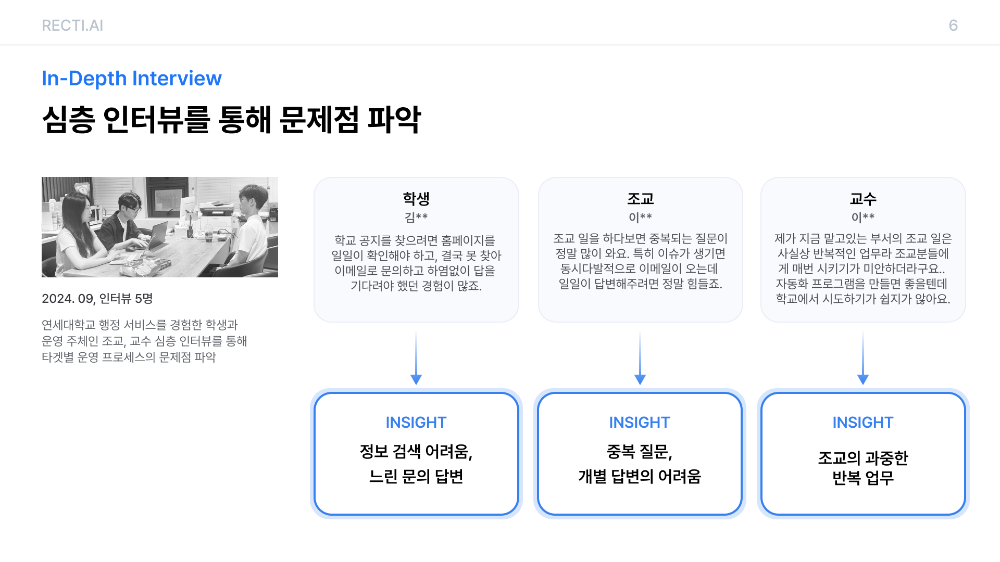 | 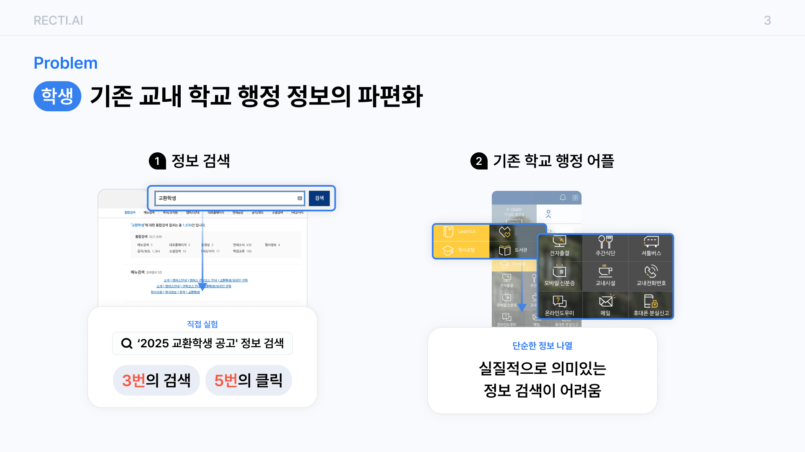 |
| 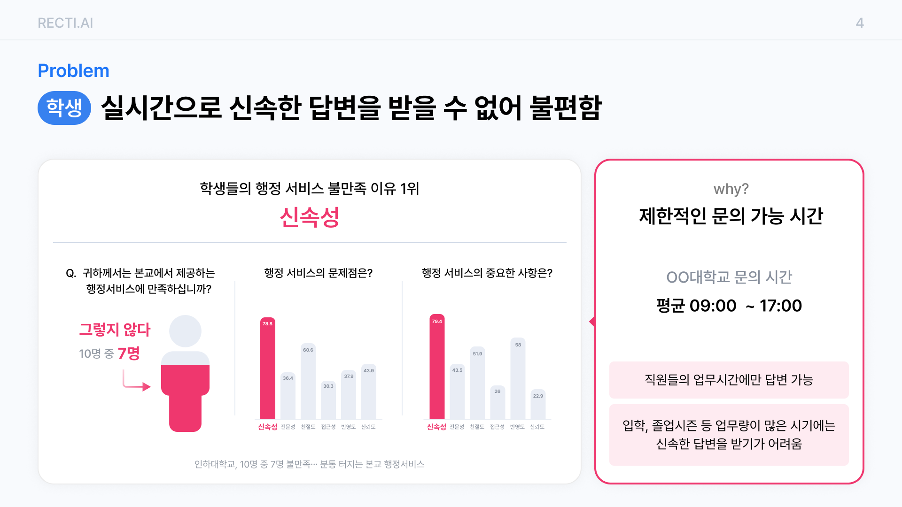 | 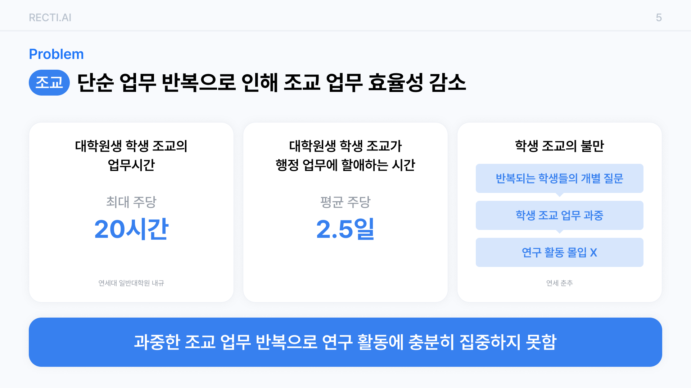 |

## 해결

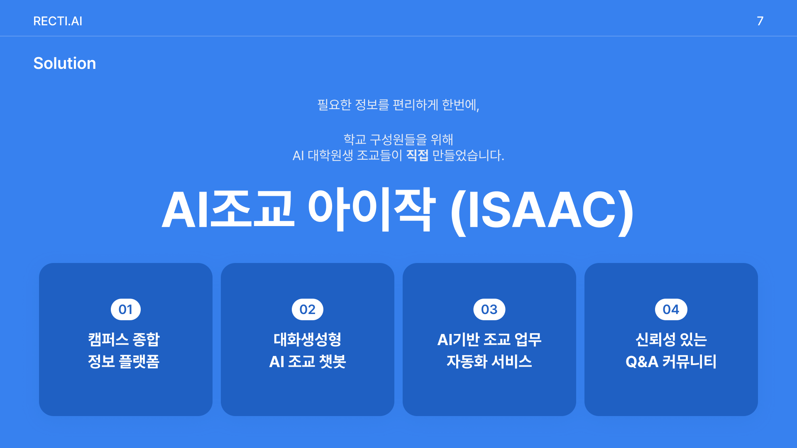

## 앱

| AI 조교 | 학과별 공지 | 키워드 알림 |
| --- | --- | --- |
| 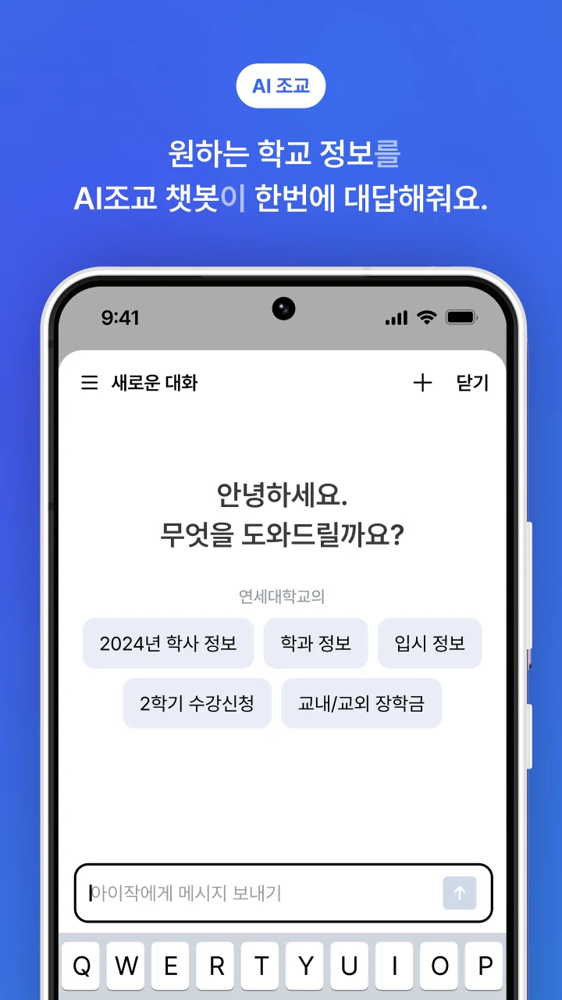 | 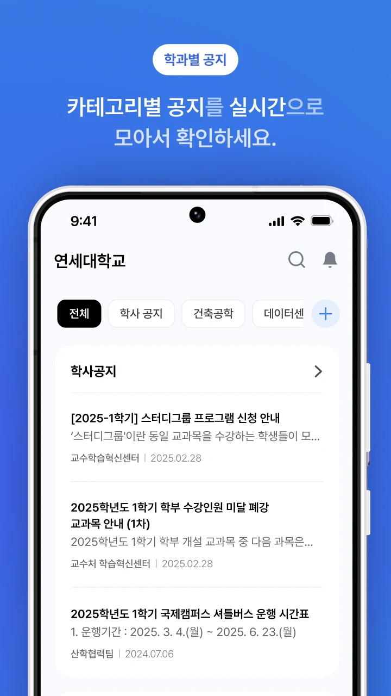 | 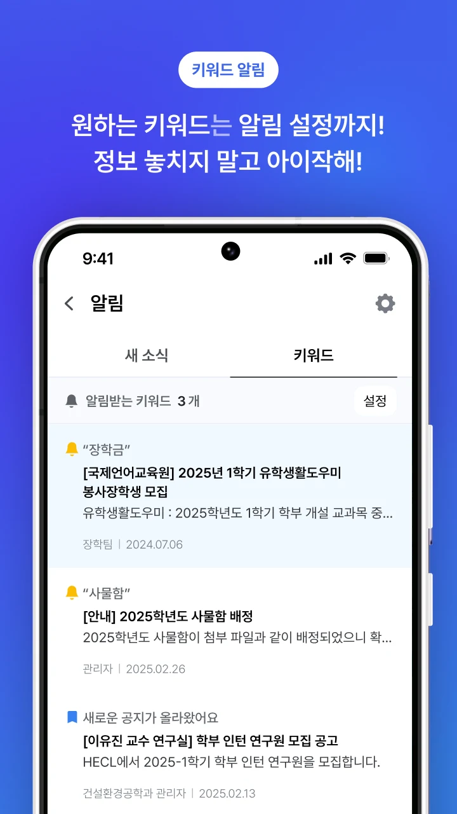 |

## 아키텍쳐


## 주요 기능

- `main.py`: FastAPI에 Gradio 채팅 UI를 붙인 데모 서버
- `api.py`: 프론트엔드용 `/api/chat` SSE API
- `utils/conversation.py`: LangGraph 멀티턴 처리
- `utils/search.py`: 일반 문서 검색과 토픽별 공지 검색
- `utils/response.py`: 검색 컨텍스트로 답변 생성
- `utils/logging_utils.py`: 사용자별 쿼리/응답 로그

## 실행

```bash
python -m venv .venv
source .venv/bin/activate
pip install fastapi uvicorn gradio openai langchain-core langgraph langid requests python-dotenv
python main.py
```

서버는 기본적으로 `http://localhost:8088`에서 실행됩니다.

## 환경 변수

`.env`에 아래 값을 설정합니다.

```env
OPENAI_API_KEY=
BACKEND_SERVER=
OPENSEARCH_ENDPOINT=
OPENSEARCH_USER=
OPENSEARCH_PASSWORD=
OPENSEARCH_GENERAL_INDEX=
OPENSEARCH_NOTICE_INDEX=
```

## API

`POST /api/chat`

- 인증: `Authorization: Bearer <token>`
- 응답: `text/event-stream`
- 주요 이벤트: `MESSAGE`, `URL`, `CHAT_ROOM_INFO`, `ELAPSED_TIME`

## 링크

| 인스타그램 | Demo 영상 | Google Play | 아이작 앱스토어 |
| --- | --- | --- | --- |
| <a href="https://www.instagram.com/issac.ai_/"></a> | <a href="https://www.youtube.com/watch?v=UNe11yl9OFo"></a> | <a href="https://play.google.com/store/apps/details?id=com.isaacai"></a> | <a href="https://apps.apple.com/kr/app/%EC%95%84%EC%9D%B4%EC%9E%91-%EB%82%98%EB%A7%8C%EC%9D%98-ai%EC%A1%B0%EA%B5%90/id6741763684">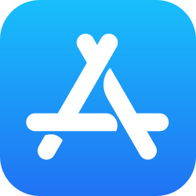</a> |

## IR

|  |  |
| --- | --- |
| 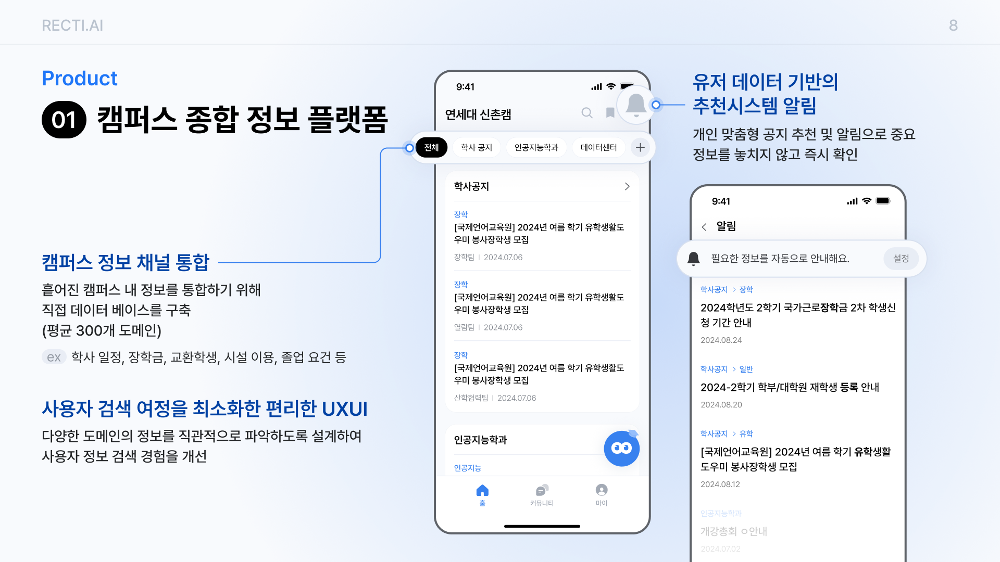 | 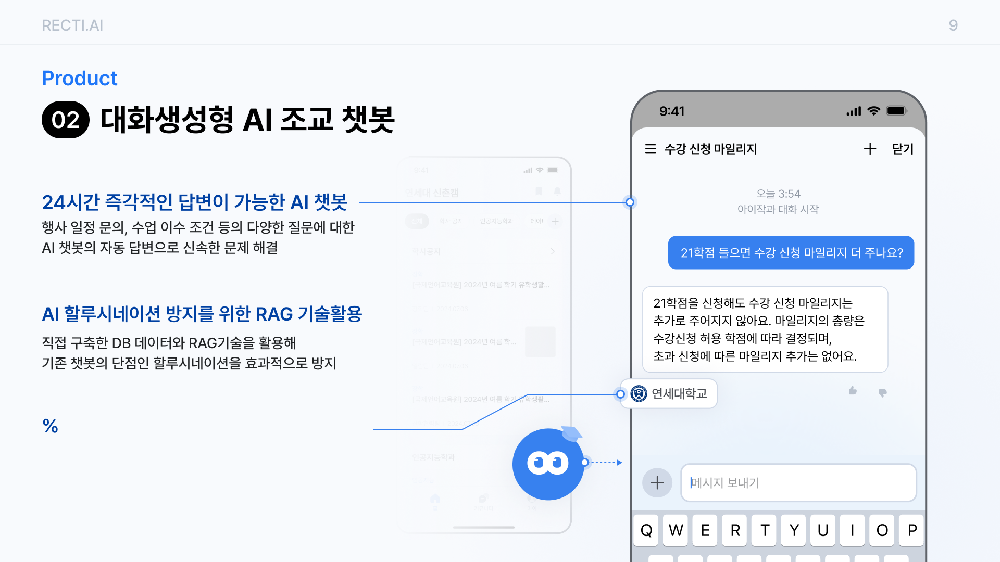 |
| 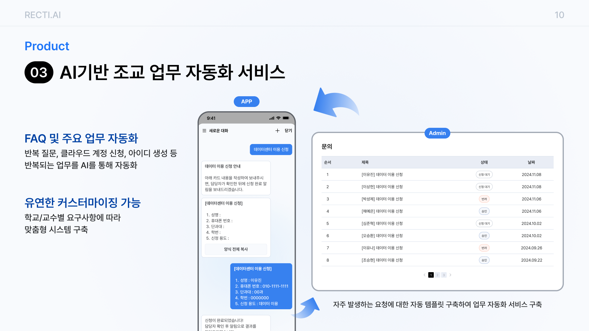 | 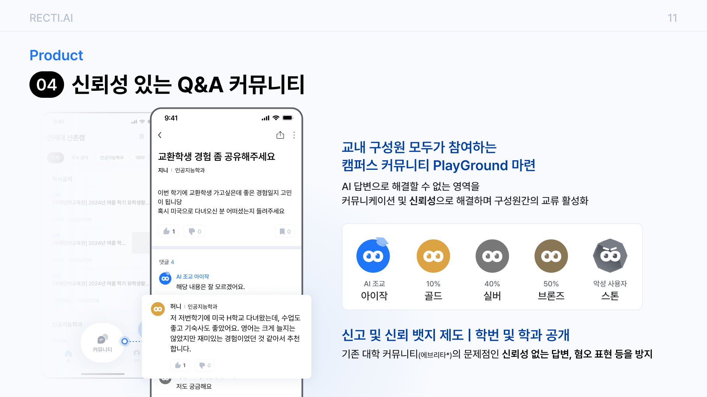 |
